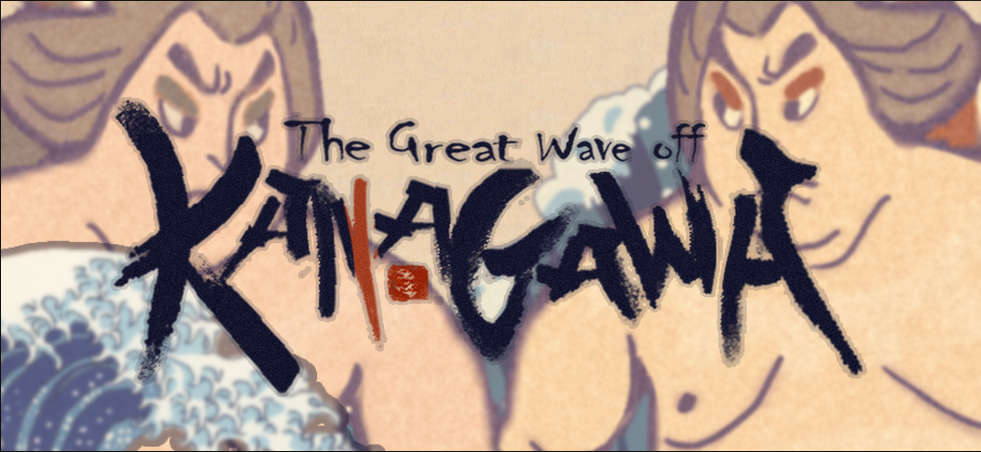

_The Great Wave off Kanagawa_ is a two-player local wave making and fighting game, made during [2017 Global Game Jam](https://globalgamejam.org/2017/games/great-wave-kanagawa). In this game, two players stand on opposite sides of the screen, trying to push the other off the screen by creating great wave as much as possible.

* Design: [Lea Liu](https://www.lealiu.com/), [leav](https://github.com/leav/)
* Program: [Feiou Su](http://www.feiousu.net/), [leav](https://github.com/leav/)
* Art: [Emma Wang](https://www.emmawang.me/), [Lea Liu](https://www.lealiu.com/)

Credits
* Original Art: [The Great Wave Off Kanagawa 神奈川沖浪裏](https://en.wikipedia.org/wiki/The_Great_Wave_off_Kanagawa)
* BGM: [S.H](http://shw.in/)

[**Play WebGL version**](https://leav.github.io/The-Great-Wave-Off-Kanagawa/)

Keyboard control:
* Player 1: W S
* Player 2: ↑ ↓ （arrow keys）
